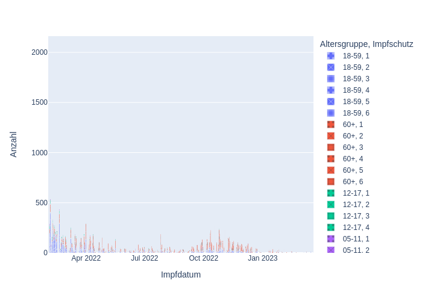
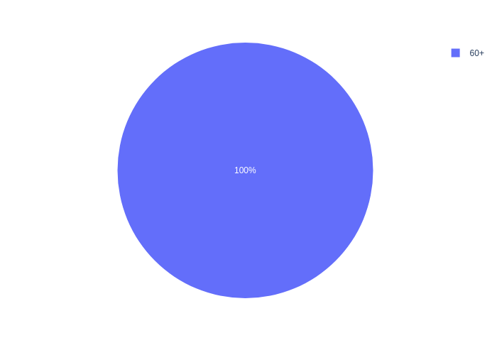
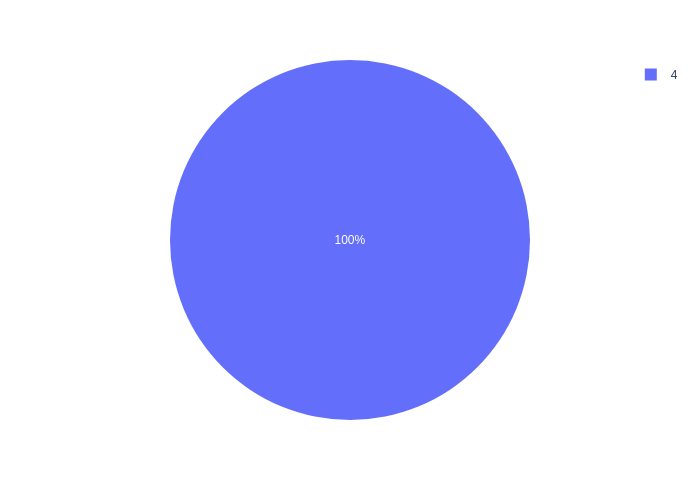

# COVID-19 Impfungen im Landkreis Weißenburg Gunzenhausen
anhand aktueller RKI-Daten.

## Verlauf Impfungen seit 01.Februar 2022

## Impfungen gestern Verteilung nach Altersgruppen

## Impfungen gestern Verteilung nach Impfschutz

## Binder Jupyter Notebook
